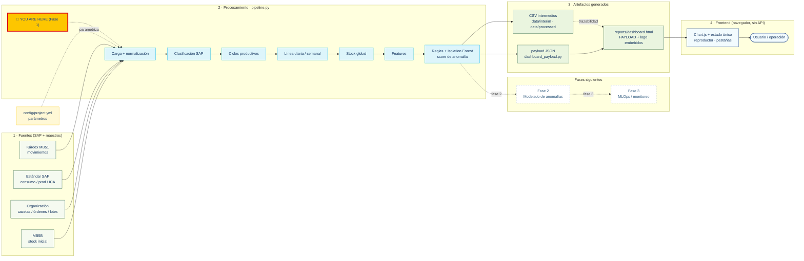

# Proyecto BI/Data Science de anomalías en consumo avícola

Proyecto reproducible en Python para convertir exportaciones operativas de SAP y maestros productivos en una plataforma BI de seguimiento de alimento, ciclos, inventario, productividad y señales iniciales de anomalía.

El repositorio está organizado como un proyecto evolutivo de tres fases:

| Fase | Estado | Objetivo |
|---|---|---|
| Fase 1 | Terminada y funcional | Plataforma BI, ETL, indicadores, inventario, dashboard, reglas y baseline inicial de anomalías. |
| Fase 2 | Pendiente | Investigación no supervisada de anomalías, comparación de modelos y validación experta. |
| Fase 3 | Futura | MLOps, despliegue, scoring productivo, monitoreo, deriva, retroalimentación y reentrenamiento. |

## Problema de negocio

El negocio necesita saber si el consumo de alimento observado es consistente con el ciclo productivo, la edad de las aves, la fase alimenticia, la producción, la mortalidad, los estándares y los movimientos SAP. El proyecto no busca afirmar fraude, merma o error de forma automática; prioriza eventos para revisión operativa con trazabilidad.

## Qué existe hoy

La Fase 1 ya implementa:

- carga de fuentes SAP y maestros desde `config/project.yml`;
- normalización de llaves, fechas y cantidades;
- clasificación auditable de movimientos SAP;
- detección de ciclos productivos;
- reconstrucción diaria de aves, mortalidad, consumo y producción;
- agregación semanal e indicadores de ICA;
- integración de estándares productivos;
- reconstrucción de stock global de alimento;
- generación de features para anomalías;
- reglas explicables de desviación;
- baseline no supervisado con Isolation Forest;
- dashboard HTML con Chart.js y payload embebido;
- reportes, tablas de control, logs, manifiesto y pruebas automatizadas.

## Arquitectura general

```text
Fuentes SAP y maestros
  -> carga y normalización
  -> clasificación de movimientos
  -> ciclos productivos
  -> línea diaria y semanal
  -> stock global
  -> features
  -> reglas + baseline no supervisado
  -> reportes y dashboard
```

La arquitectura detallada está en `docs/architecture.md`.

## Flujo de datos (de la fuente al frontend)

El proyecto sigue un patrón **batch + artefacto autocontenido**: no hay servidor
ni API en tiempo de ejecución. Los datos se transforman una vez en el pipeline y
el resultado se **incrusta** en un único HTML que el navegador consume del lado
del cliente.

**1. Fuentes (entrada).** Exportaciones SAP y maestros productivos en
`data/raw/`, declarados en `config/project.yml`:

- **Kárdex MB51** — movimientos de inventario (entradas, consumo, traspasos,
  ajustes, mermas, logística).
- **Estándar SAP** — consumo, producción e ICA esperados por edad.
- **Organización** — casetas, órdenes, lotes y fechas.
- **MB5B** — ancla de stock inicial de alimento.

`config/project.yml` **parametriza** todo (centro, granja, casetas, materiales,
almacenes, fechas, umbrales): no hay valores de granja embebidos en el código.

**2. Procesamiento (Fase 1).** `src/granjas_anomalias/pipeline.py` ejecuta el
ETL determinista (11 etapas): carga y normalización → clasificación auditable de
movimientos SAP → detección de ciclos → reconstrucción de la línea diaria y
semanal → stock global de alimento → *features* → reglas explicables + baseline
no supervisado (`IsolationForest`) que produce el **score de anomalía**.

**3. Artefactos (salida).** El pipeline escribe CSV intermedios trazables
(`data/interim`, `data/processed`), reportes, el modelo y un
`reports/run_manifest.json`. Para el dashboard, `dashboard_payload.py` construye
un **payload JSON** (ciclos, línea diaria, stock compartido, anomalías) que
`dashboard.py` inyecta en la plantilla reemplazando los marcadores
`__PAYLOAD_JSON__` (datos) y `__LOGO_DATA_URI__` (logo base64). El resultado,
`reports/dashboard.html`, es **autocontenido y portable**.

**4. Consumo en el frontend.** El navegador abre el HTML; el payload viaja
embebido como literal JavaScript (`const PAYLOAD = {…}`). Toda la lógica de
presentación ocurre **del lado del cliente** con Chart.js sobre un **estado
único** (un reproductor temporal, fecha global y pestañas por dominio). El
usuario navega alimento, casetas, ciclos, anomalías y control técnico sin
peticiones de red. La guía de uso está en
[docs/MANUAL_USUARIO.md](docs/MANUAL_USUARIO.md).

### Diagrama del flujo (Graphviz)

Renderiza el siguiente `.dot` con `dot -Tsvg flujo.dot -o flujo.svg`, con la
extensión *Graphviz Preview* o en [dreampuf.github.io/GraphvizOnline](https://dreampuf.github.io/GraphvizOnline/).

```dot
digraph crio_bi {
  rankdir=LR;
  labelloc="t";
  label="CRÍO · BI de anomalías de consumo — flujo de datos (Fase 1)";
  fontname="Helvetica"; fontsize=16;
  node [shape=box, style="rounded,filled", fontname="Helvetica",
        fillcolor="#F2FBFE", color="#1A428A", fontcolor="#12335E"];
  edge [color="#315B7F", fontname="Helvetica", fontsize=10];

  // 1) Fuentes
  subgraph cluster_sources {
    label="1 · Fuentes (SAP + maestros)";
    style="rounded,filled"; fillcolor="#F5FAF0"; color="#266041";
    mb51 [label="Kárdex MB51\n(movimientos)"];
    std  [label="Estándar SAP\n(consumo / prod. / ICA)"];
    org  [label="Organización\n(casetas / órdenes / lotes)"];
    mb5b [label="MB5B\n(stock inicial)"];
  }

  config [label="config/project.yml\n(parámetros)", shape=note,
          fillcolor="#FFF8D6", color="#FDC600"];

  // 2) Procesamiento (Fase 1) — clúster central
  subgraph cluster_pipeline {
    label="2 · Procesamiento · pipeline.py";
    style="rounded,filled"; fillcolor="#DDF5FB"; color="#00B2E3";

    here [label="📍 YOU ARE HERE (Fase 1)", shape=box,
          style="filled,bold", fillcolor="#FDC600",
          color="#DC0814", fontcolor="#1A428A", penwidth=3];

    load     [label="Carga + normalización"];
    classify [label="Clasificación SAP"];
    cycles   [label="Ciclos productivos"];
    daily    [label="Línea diaria / semanal"];
    stock    [label="Stock global"];
    feats    [label="Features"];
    rules    [label="Reglas + Isolation Forest\n(score de anomalía)"];

    here -> load [style=invis];
    load -> classify -> cycles -> daily -> stock -> feats -> rules;
  }

  // 3) Artefactos
  subgraph cluster_artifacts {
    label="3 · Artefactos generados";
    style="rounded,filled"; fillcolor="#EAF5DF"; color="#266041";
    csv     [label="CSV intermedios\n(data/interim, data/processed)", shape=folder];
    payload [label="payload JSON\n(dashboard_payload.py)"];
    html    [label="reports/dashboard.html\n(PAYLOAD + logo embebidos)",
             fillcolor="#FFFFFF"];
  }

  // 4) Frontend (navegador, sin servidor)
  subgraph cluster_frontend {
    label="4 · Frontend (navegador, sin API)";
    style="rounded,filled"; fillcolor="#F2FBFE"; color="#1A428A";
    chart [label="Chart.js + estado único\n(reproductor · pestañas)"];
    user  [label="Usuario / operación", shape=oval, fillcolor="#EAF5DF"];
  }

  // 5) Fases futuras
  subgraph cluster_future {
    label="Fases siguientes";
    style="rounded,dashed"; color="#9DB4CD";
    f2 [label="Fase 2\nModelado de anomalías", style="rounded,dashed", fillcolor="#FFFFFF"];
    f3 [label="Fase 3\nMLOps / monitoreo",      style="rounded,dashed", fillcolor="#FFFFFF"];
  }

  // Flujo principal
  { mb51 std org mb5b } -> load;
  config -> load    [style=dashed, label="parametriza"];
  rules -> csv;
  rules -> payload;
  payload -> html;
  csv -> html       [style=dashed, label="trazabilidad"];
  html -> chart -> user;
  rules -> f2       [style=dashed];
  f2 -> f3          [style=dashed];
}
```



### Versión Mermaid (se renderiza directo en GitHub)

GitHub no renderiza Graphviz, pero sí Mermaid. El siguiente diagrama equivale al
anterior y se ve en línea en el repositorio:



## Documentación

| Documento | Para quién | Contenido |
|---|---|---|
| [docs/MANUAL_USUARIO.md](docs/MANUAL_USUARIO.md) | Usuario final | Cómo leer y operar el dashboard: pestañas, reproductor, gestos (zoom y declutter), interpretación y cómo cargar otra granja. |
| [docs/runbook.md](docs/runbook.md) | Operación | Instalar, configurar, ejecutar el pipeline, validar y solucionar problemas. |
| [docs/architecture.md](docs/architecture.md) · [docs/ARQUITECTURA.md](docs/ARQUITECTURA.md) | Técnico | Arquitectura y flujo de datos. |
| [docs/data_dictionary.md](docs/data_dictionary.md) · [docs/DICCIONARIO_DATOS.md](docs/DICCIONARIO_DATOS.md) | Técnico | Diccionario de datos y campos. |
| [docs/REGLAS_MOVIMIENTOS_SAP.md](docs/REGLAS_MOVIMIENTOS_SAP.md) · [docs/FORMULAS_PRODUCTIVAS.md](docs/FORMULAS_PRODUCTIVAS.md) | Técnico/negocio | Clasificación SAP y fórmulas productivas. |
| [docs/METODOLOGIA_ANOMALIAS.md](docs/METODOLOGIA_ANOMALIAS.md) | Técnico | Reglas y baseline de anomalías. |
| [docs/roadmap.md](docs/roadmap.md) · [docs/PLAN_ML_FASE2.md](docs/PLAN_ML_FASE2.md) | Planeación | Siguientes pasos y Fase 2/3. |
| [CHANGELOG.md](CHANGELOG.md) | Todos | Historial de cambios. |

## Estructura del repositorio

```text
config/                     Configuración local y ejemplo seguro
data/                       Datos raw, cache, intermedios y procesados
docs/                       Documentación funcional y técnica
legacy/                     Código preservado del prototipo
models/                     Modelos generados
notebooks/                  Laboratorios de análisis
reports/                    Reportes, figuras, tablas y dashboards generados
scripts/                    Validadores y comandos auxiliares
src/granjas_anomalias/      Paquete productivo
tests/                      Pruebas automatizadas
```

Los datos reales, reportes generados, dashboards con payload, modelos, logs y configuración local están protegidos por `.gitignore`.

## Fuentes de datos

El pipeline espera, según `config/project.yml`:

- kardex SAP MB51;
- estándar productivo semanal;
- maestro de organización;
- maestro de materiales;
- ancla de stock inicial MB5B, cuando aplique.

`config/project.example.yml` contiene valores ficticios y seguros para documentar la estructura sin exponer datos.

## Instalación

```powershell
py -3 -m venv .venv
.\.venv\Scripts\Activate.ps1
python -m pip install --upgrade pip
python -m pip install -e .
```

También puede usarse:

```powershell
pip install -r requirements.txt
```

## Ejecución

Con el entorno activo:

```powershell
python -m granjas_anomalias.cli run --config config/project.yml
```

Para otra granja, pasa su configuración con `--config config/<granja>.yml`.

> Nota: usa el **CLI del módulo** (`granjas_anomalias.cli`) para elegir
> configuración. El script `scripts/run_pipeline.py` usa siempre
> `config/project.yml` e **ignora `--config`**.

O mediante scripts:

```powershell
scripts\run_all.bat
```

El resultado principal es `reports/dashboard.html`. Para usarlo, ver el
[Manual de usuario](docs/MANUAL_USUARIO.md).

## Validaciones

Pruebas automatizadas:

```powershell
pytest
```

Validación del payload:

```powershell
python scripts/validar_dashboard_payload.py
```

Validación del dashboard HTML:

```powershell
python scripts/validar_dashboard_html.py
```

Validación opcional de resultados de referencia:

```powershell
python scripts/check_reference_results.py
```

Los controles exactos de referencia deben declararse en el `config/project.yml` local, dentro de `reference_validation`.

## Salidas principales

- `data/interim/01_kardex_normalizado_clasificado.csv`
- `data/interim/02_organizacion_normalizada.csv`
- `data/interim/03_materiales_normalizados.csv`
- `data/processed/04_politica_preparada.csv`
- `data/processed/05_ciclos_detectados.csv`
- `data/processed/06_linea_diaria_ciclos.csv`
- `data/processed/07_resumen_semanal_ciclos.csv`
- `data/processed/08_stock_alimento_diario_por_material.csv`
- `data/processed/09_stock_alimento_diario_global.csv`
- `data/processed/10_features_y_scores_diarios.csv`
- `data/processed/11_anomalias_consumo.csv`
- `reports/tables/05_plantilla_validacion_anomalias.csv`
- `reports/EDA_Y_ANOMALIAS.md`
- `reports/dashboard.html`
- `reports/run_manifest.json`
- `models/isolation_forest_consumo.joblib`

Estas salidas se consideran artefactos generados y no deben publicarse con datos reales.

## Baseline actual de anomalías

El baseline actual es no supervisado. `src/granjas_anomalias/models.py` entrena un `IsolationForest` dentro de un `Pipeline` con imputación mediana y escalamiento robusto. Consume variables de consumo por ave, brecha contra estándar, z-score robusto, cambio diario, estadísticas móviles, mortalidad, producción, edad y fases activas.

El score final combina:

- `score_reglas`, generado por reglas auditables en `anomaly_rules.py`;
- `score_ml`, generado por Isolation Forest;
- pesos y umbrales definidos en configuración.

Este baseline sirve para priorización y revisión experta. No es un modelo final validado.

## Roadmap

- Fase 1: completada. Mantener y mejorar diseño, documentación, pruebas, seguridad y mantenibilidad sin cambiar reglas de negocio.
- Fase 2: pendiente. Ejecutar experimentación no supervisada en `notebooks/02_modelado_anomalias_no_supervisado.ipynb`, comparar modelos y seleccionar candidato con expertos.
- Fase 3: futura. Industrializar entrenamiento, scoring, monitoreo, drift, retroalimentación y reentrenamiento.

El roadmap operativo está en `docs/roadmap.md`.

## Seguridad

No publicar:

- `config/project.yml`;
- `data/`;
- `reports/`;
- `models/`;
- `logs/`;
- dashboards HTML generados;
- notebooks ejecutados con datos reales;
- credenciales, rutas personales, órdenes, lotes, documentos SAP o payloads reales.

GitHub Pages solo debe usarse con datos sintéticos o anonimizados.
