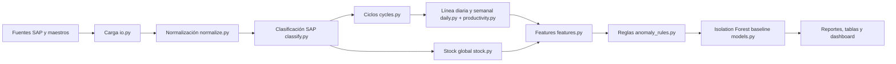
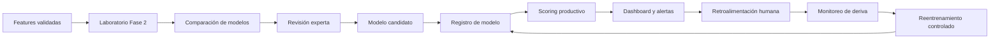

# Arquitectura

## Arquitectura actual - Fase 1

La Fase 1 genera datasets intermedios, procesados, reportes, figuras, modelo baseline, payload y dashboard HTML.

## Arquitectura objetivo - Fases 2 y 3

## Capas actuales

| Capa | Ruta | Descripción |
|---|---|---|
| Raw | `data/raw/` | Exportaciones y fuentes originales. |
| Cache | `data/cache/` | Cache local de lectura. |
| Interim | `data/interim/` | Datos normalizados y clasificados. |
| Processed | `data/processed/` | Ciclos, línea diaria, stock, features y anomalías. |
| Models | `models/` | Artefactos generados del baseline. |
| Reports | `reports/` | Figuras, tablas, dashboard y manifiesto. |
| Source | `src/granjas_anomalias/` | Código productivo del pipeline. |

## Principios

- Raw no se modifica.
- El stock físico se separa del consumo atribuido por ciclo.
- Las reglas son auditables y exportan combinaciones no clasificadas.
- El baseline no supervisado prioriza revisión, no reemplaza criterio experto.
- Los dashboards generados con payload real no son publicables.
