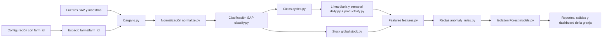
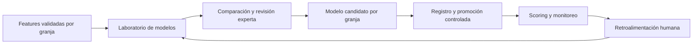

# Arquitectura

## Arquitectura actual

El código y las reglas son compartidos. `project.farm_id` coloca todas las
entradas y salidas mutables dentro de `farms/<farm_id>/`.

## Capas

| Capa | Ruta | Descripción |
|---|---|---|
| Raw | `farms/<farm_id>/data/raw/` | Exportaciones y fuentes originales. |
| Cache | `farms/<farm_id>/data/cache/` | Caché local de lectura. |
| Interim | `farms/<farm_id>/data/interim/` | Datos normalizados y clasificados. |
| Processed | `farms/<farm_id>/data/processed/` | Ciclos, línea diaria, stock, features y anomalías. |
| Database | `farms/<farm_id>/data/warehouse.db` | Cargas, movimientos, ejecuciones y alertas de una granja. |
| Models | `farms/<farm_id>/models/` | Artefactos del modelo exclusivos de una granja. |
| Reports | `farms/<farm_id>/reports/` | Figuras, tablas, dashboard y manifiesto. |
| Outputs | `farms/<farm_id>/outputs/` | Estado vigente e historial operativo. |
| Logs | `farms/<farm_id>/logs/` | Bitácora de ejecución. |
| Source | `src/granjas_anomalias/` | Código productivo compartido. |

## Separación de responsabilidades

- `config.py` valida `farm_id` y evita rutas absolutas o que escapen de la
  carpeta de la granja.
- `pipeline.py` coordina el proceso sin definir reglas de negocio nuevas.
- Los módulos de cálculo reciben `ProjectConfig`; no deciden dónde viven los
  datos de otra granja.
- SQLite, modelos, reportes, outputs y logs se abren mediante rutas ya
  delimitadas por la configuración.
- Los scripts aceptan `--config` para elegir una configuración antes de
  ejecutar.

## Principios

- Raw no se modifica.
- Una granja no comparte caché, base, modelo, salidas ni logs con otra.
- Ninguna ruta operativa puede escapar de `farms/<farm_id>/`.
- El stock físico se separa del consumo atribuido por ciclo.
- Las reglas son auditables y exportan combinaciones no clasificadas.
- El baseline no supervisado prioriza revisión; no reemplaza criterio experto.
- Los dashboards con payload real requieren control de acceso.
- Cambiar rutas no autoriza cambiar cálculos, umbrales ni modelos.

## Arquitectura objetivo posterior

La extracción automática de SAP, el dashboard con selector de granja y el
gobierno central de modelos no pertenecen a esta Fase 1.
